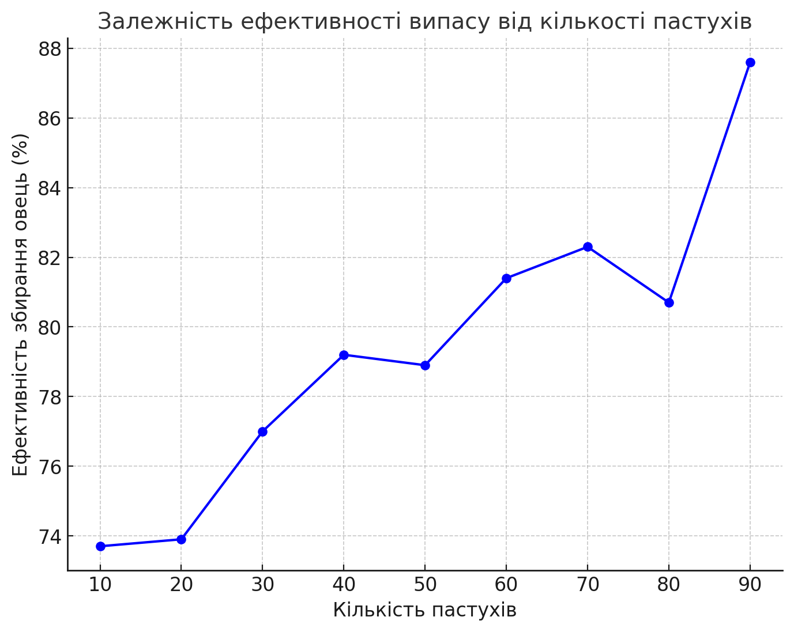
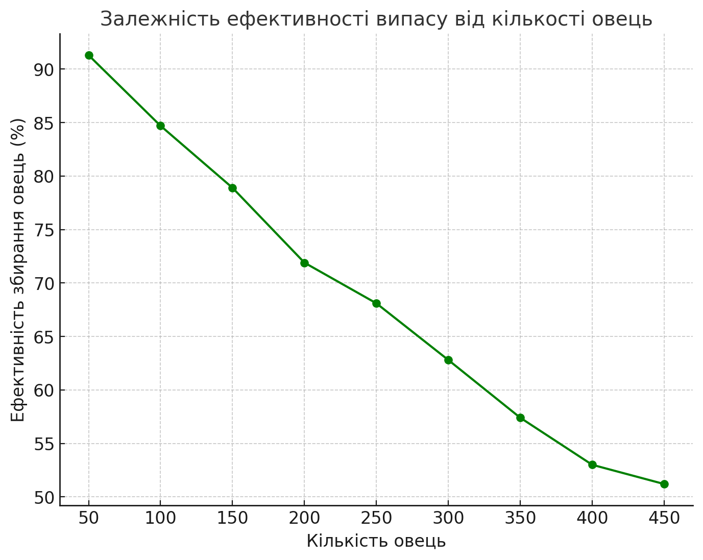
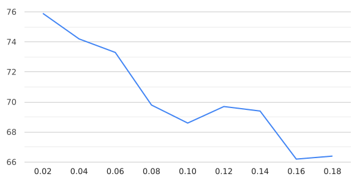

## Комп'ютерні системи імітаційного моделювання
## СПм-23-5, Литвинов Андрій Павлович
### Лабораторна робота №**1**. Опис імітаційних моделей та проведення обчислювальних експериментів

 

### Варіант 9, модель у середовищі NetLogo:
[Sheperds](https://www.netlogoweb.org/launch#http://www.netlogoweb.org/assets/modelslib/Sample%20Models/Biology/Shepherds.nlogo) Розгляд процесу пошуку та збирання вівець у стада.

 

### Вербальний опис моделі:
Симуляція сбору овець пстухами у стадо. Пастухи дотримуються низки простих правил. Кожен пастух починає блукати випадковим чином. Якщо він натикається на вівцю, він підбирає вівцю та продовжує безладно блукати. Коли він натикається на іншу вівцю, він знаходить вільне місце поблизу, кладе свою вівцю та шукає іншу.

### Керуючі параметри:
- **num-sheep**: кількість овець у моделі. Цей параметр визначає, скільки овець буде створено під час ініціалізації моделі.
- **num-shepherds:**: кількість пастухів у моделі. Цей параметр задає кількість пастухів, які будуть створені.
- **sheep-speed**: швидкість переміщення овець. Визначає, як швидко вівці рухатимуться по простору.

### Внутрішні параметри:
- pcolor: колір патчів, який варіюється, щоб зробити візуалізацію приємнішою (відтінки зеленого).
- sheep-nearby (в змінній patches-own): кількість овець у сусідніх патчах, використовується для визначення насиченості області вівцями.
- carried-sheep (в змінній shepherds-own): це змінна для кожного пастуха, яка показує, чи несе він зараз вівцю. Якщо несе, то зберігається посилання на цю вівцю.
- found-herd? (в змінній shepherds-own): булева змінна, яка визначає, чи знайшов пастух стадо, куди можна скинути вівцю.
- hidden? (в змінній sheep): ця змінна використовується, щоб зробити вівцю "прихованою", коли її несе пастух (вона стає невидимою для інших пастухів).

### Показники роботи системи:
- sheepless-neighborhoods: кількість патчів, навколо яких немає овець. Цей показник дає інформацію про те, наскільки овець "розсіяно" по території.
- herding-efficiency: ефективність збирання овець пастухами. Обчислюється як відсоткове співвідношення патчів без овець у їхньому оточенні до загальної кількості патчів без овець.

### Примітки:
Пастух змінює колір на синій, коли несе вівцю, і повертає колір на коричневий після того, як її скидає, що надає корисний візуальний сигнал для спостереження за процесом.

### Недоліки моделі:
Оскільки і вівці, і пастухи рухаються випадковим чином завдяки процедурі wiggle, яка дає їм довільні обертання перед рухом, ефективність пастухів може бути досить низькою. Пастухи можуть витрачати багато часу на пошук овець, навіть якщо вони знаходяться поблизу. Це робить модель менш схожою на реальну систему випасу.

 

## Обчислювальні експерименти

### 1. Вплив кількості пастухів на ефективність
Досліджується залежність ефективності пастухів протягом певної кількості тактів (500) від їх кількості, зазначеного на початку симуляції.
Експерименти проводяться при 10-90 пастухах, з кроком 10, усього 9 симуляцій.
Інші керуючі параметри мають значення за замовчуванням:
- **num-sheep**: 150
- **sheep-speed**: 0.02

<table>
<thead>
<tr><th>Кількість пастухів</th><th>Ефективність</th></tr>
</thead>
<tbody>
<tr><td>10</td><td>73.7</td></tr>
<tr><td>20</td><td>73.9</td></tr>
<tr><td>30</td><td>77</td></tr>
<tr><td>40</td><td>79.2</td></tr>
<tr><td>50</td><td>78.9</td></tr>
<tr><td>60</td><td>81.4</td></tr>
<tr><td>70</td><td>82.3</td></tr>
<tr><td>80</td><td>80.7</td></tr>
<tr><td>90</td><td>87.6</td></tr>
</tbody>
</table>

Ось графік, який показує залежність ефективності збирання овець від кількості пастухів. Він наочно ілюструє зростання ефективності до певного моменту, а також коливання на високих значеннях кількості пастухів через випадковість руху.

### 2. Вплив кількості овець на ефективність
Досліджується залежність ефективності пастухів протягом певної кількості тактів (500) від кількості овець, зазначеного на початку симуляції.
Експерименти проводяться при 50-450 вівцях, з кроком 50, усього 9 симуляцій.
Інші керуючі параметри мають значення за замовчуванням:
- **num-shepherds:**: 30
- **sheep-speed**: 0.02

<table>
<thead>
<tr><th>Кількість овець</th><th>Ефективність</th></tr>
</thead>
<tbody>
<tr><td>50</td><td>91.3</td></tr>
<tr><td>100</td><td>84.7</td></tr>
<tr><td>150</td><td>78.9</td></tr>
<tr><td>200</td><td>71.9</td></tr>
<tr><td>250</td><td>68.1</td></tr>
<tr><td>300</td><td>62.8</td></tr>
<tr><td>350</td><td>57.4</td></tr>
<tr><td>400</td><td>53</td></tr>
<tr><td>450</td><td>51.2</td></tr>
</tbody>
</table>

Ось графік, який показує залежність ефективності збирання овець від кількості овець. Він наочно ілюструє постійне падіння ефективності по мірі збільшення кількості овець.

### 3. Вплив швидкості овець на ефективність
Досліджується залежність ефективності пастухів протягом певної кількості тактів (500) від швидкості овець, зазначеного на початку симуляції.
Експерименти проводяться при швидкості овець 0.02-0.18 , з кроком 0.02, усього 9 симуляцій.
Інші керуючі параметри мають значення за замовчуванням:
- **num-shepherds:**: 30
- **num-sheep**: 150

<table>
<thead>
<tr><th>Швидкість овець</th><th>Ефективність</th></tr>
</thead>
<tbody>
<tr><td>0.02</td><td>75.9</td></tr>
<tr><td>0.04</td><td>74.2</td></tr>
<tr><td>0.06</td><td>73.3</td></tr>
<tr><td>0.08</td><td>69.8</td></tr>
<tr><td>1.0</td><td>68.6</td></tr>
<tr><td>0.12</td><td>69.7</td></tr>
<tr><td>0.14</td><td>69.4</td></tr>
<tr><td>0.16</td><td>66.2</td></tr>
<tr><td>0.18</td><td>66.4</td></tr>
</tbody>
</table>

Ось графік, який показує залежність ефективності збирання овець від швидкості овець. Він наочно ілюструє постійне падіння ефективності по мірі збільшення швидкості овець. При цьому стада перестать формуватись на швидкості понад 0.6, оскільки вівці встигають розбігатись до того як їх повернуть у стадо пастухи. 
